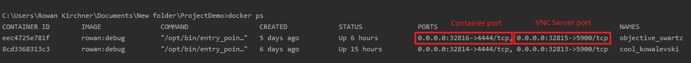
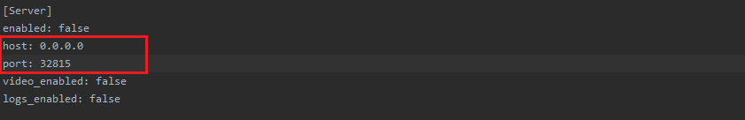
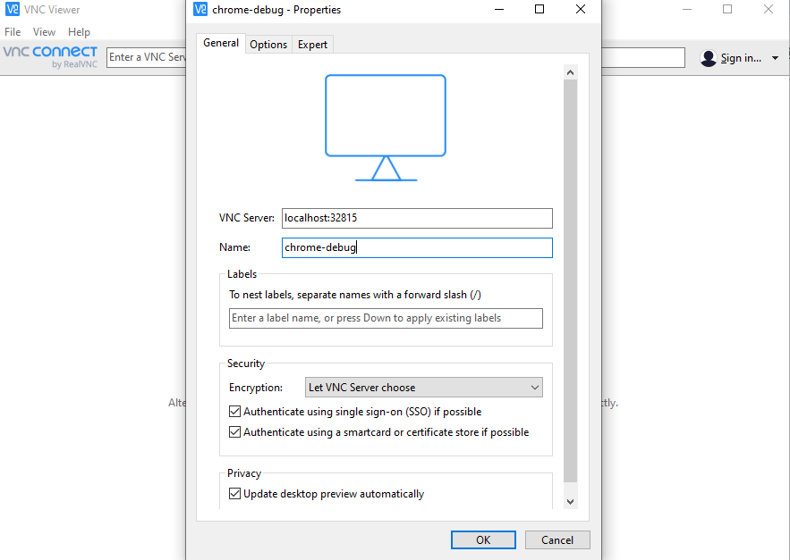
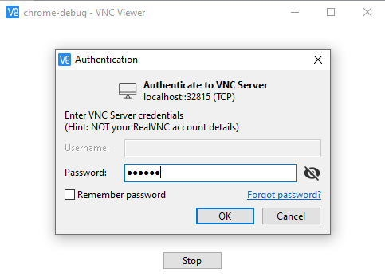

# Headless Test & VNC environment

### Download RealVNC viewer:

You can download the [real-vnc](https://www.realvnc.com/en/connect/download/viewer/macos/). and Install as per your\
operating system.

##Running docker image

####  Step 1:
For the Debugging we should require the Docker Selenium WebDriver Image with VNC server.So First Step is to build the \
docker file
```sh
$ docker pull rowanwk/rowan:debug
```

#### Step 2:
the following step mounts the volume to the desired location within the container using flag -v. To get the ports to \
link container with VNC server we use flag -P
  
```sh
$ docker run -v C:/Users/:/dev/smh/ -d -P rowan:debug
```

#### Step 3:
After running the Docker container we should verify the Container Process and Port Details.
```sh
$ docker ps
```



#### Step 4:

Go to properties.cfg file and insert host and port



##Starting VNC and create VNC

####Step 1: 

Open real VNC viewer downloaded in the previous Steps.

####Step 2: 
From File Menu select: Create New Connection

####Step 3: 
Enter Value of VNC Server as localhost:



#### Step 4:

When you are prompted for the password it is ***secret***



## Running Tests

#### Step 1:
Bash into the running container:

```sh
$ docker exec -it <container ID> /bin/bash
```

####Step 2:

cd into your working directory

#### Step 3:

Run tests with behave

